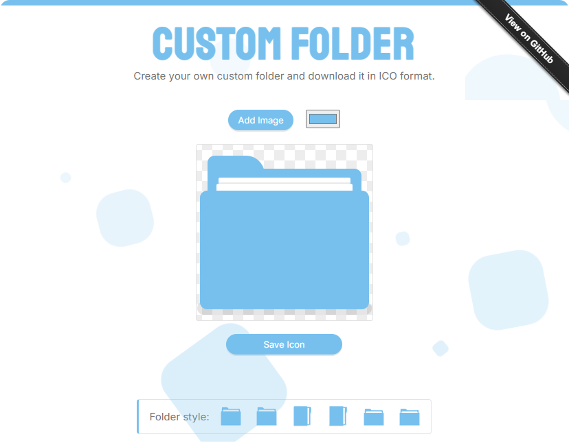

<h1 align="center">Custom Folder 💎</h1>

Image to Icon is a web app to create your own custom folder icon.

 

## Features
- Pick the color you want.
- Three different style pairs.
- Add images as stickers.
- Save as icon.

 

## Info
Credits can be found on the [about](https://genesistoxical.github.io/customfolder/about.html) page.

**MIT LICENSE** - Copyright (c) 2025 Génesis Toxical
